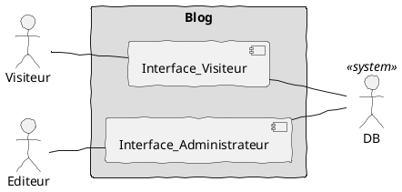
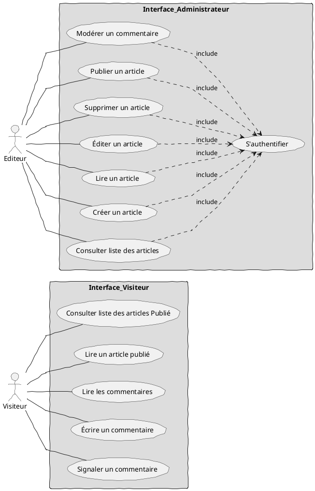
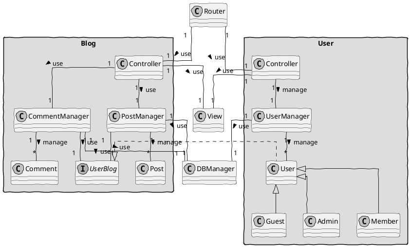
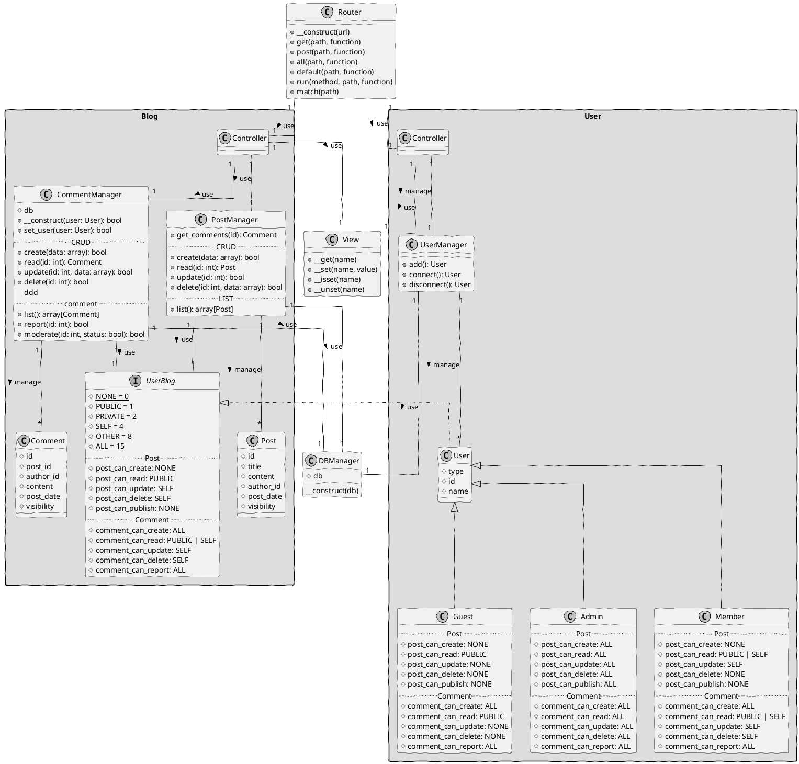
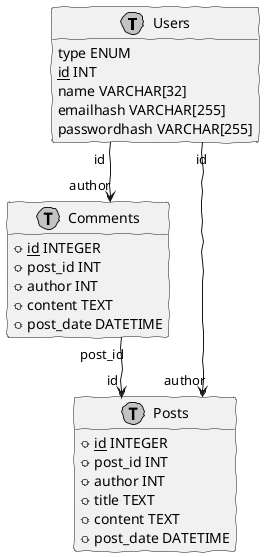

---
export_on_save:
  markdown: true
markdown:
  image_dir: /doc/img
  path: /README.md
  ignore_from_front_matter: false
  absolute_image_path: true
toc:
  depth_from: 2
  depth_to: 6
  ordered: false
---

# Créez un blog pour un écrivain

[TOC]
## Besoin
### Quoi ?

Jean Forteroche, acteur et écrivain, travaille actuellement sur son prochain roman, "Billet simple pour l'Alaska". Il souhaite le publier par épisode en ligne sur son propre site.

Jean souhaite avoir son propre outil de blog, offrant des fonctionnalités plus simples.

Elle doit fournir une interface frontend (lecture des billets) et une interface backend (administration des billets pour l'écriture). On doit y retrouver tous les éléments d'un CRUD.

Chaque billet doit permettre l'ajout de commentaires, qui pourront être modérés dans l'interface d'administration au besoin, et être "signaler" par les lecteurs pour que ceux-ci remontent plus facilement dans l'interface d'administration pour être modérés.

L'interface d'administration sera protégée par mot de passe. La rédaction de billets se fera dans une interface WYSIWYG basée sur TinyMCE.

### Livrable

Fichiers à fournir

-   Code HTML, CSS, PHP et JavaScript
-   Export de la base de données MySQL
-   Lien vers la page GitHub contenant l'historique des commits

### Soutenance
Vous vous positionnerez comme un développeur présentant pendant 25 minutes son travail à son collègue plus senior dans l’agence web afin de vérifier que le projet peut être présenté tel quel à Jean Forteroche. Cette étape sera suivie de 5 minutes de questions/réponses.

### Comment ?

Vous allez donc devoir développer un moteur de blog en PHP et MySQL.
Vous développerez sur une architecture MVC orienté objet sans utiliser de framework.

## Étude du projet

### Utilisateurs

```puml {filename="users.png"}
@startuml

skinparam monochrome true
skinparam shadowing false
skinparam handwritten true
skinparam defaultFontName Comic Sans MS

skinparam linetype polyline
skinparam packageBackgroundColor #DDDDDD

left to right direction

actor Visiteur
actor Editeur

rectangle Blog #DDDDDD

Visiteur -- Blog
Editeur -- Blog

@enduml
```

### Interfaces

### Cas d'utilisation

### Classes

### Base de données

## Documentation
### Structure
Le projet utilise la hierarchie suivante

- **cfg** : contient la configuration
- **mod** : contient les modules (partie exécutive)
  - **Router** : coordonne les actions
  - **Controller** : traite les actions
  - **Manager** : traite les données
- **dat** : contient les données (nécessite vérification ou modification)
  - **vue** : contient les vues
- **res** : contient les ressources (servis en l'état)
